## Contents

- 1) INTRODUCTION
- 2) PARSER & INTERPRETER
   - 2.a Design of The Algorithm
   - 2.b Memory
   - 2.c Outs
   - 2.e Arithmetic Operations
   - 2.f Execution of Blocks
- 3) USER INPUTS & INTERPRETER IMPLEMENTATION
- 4) Test Screenshots
   - 4.a Finding the nth Fibonacci of 101 Digits
   - 4.b Finding The Sum of The Consecutive Numbers Squared
   - 4.c Drawing a Right-Angled Triangle
   - 4.d Syntax Error Example
   - 4.e Syntax Error Example

 
 

## 1) INTRODUCTION

For the implementation of the interpreter the IDE Apache NetBeans 12.2 and Cygwin have been
used.

As two project groups have come together, there have been problems in being able to work and
execute the code due to differences in compilers, that is why it has been obtained by working
temporarily during the project with an online compiler. We leave the link here in case execution
problems arise. To be able to see the documents that we use in the code production you must click
on the "code" tab.

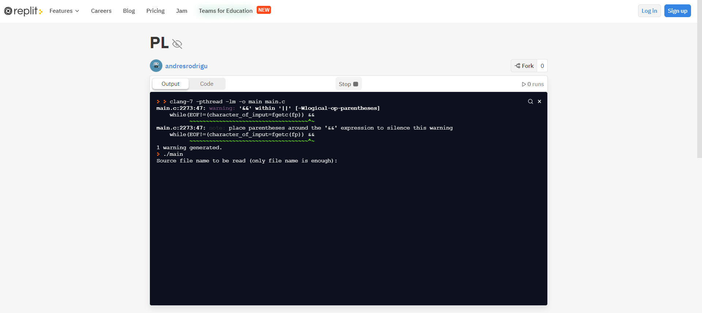
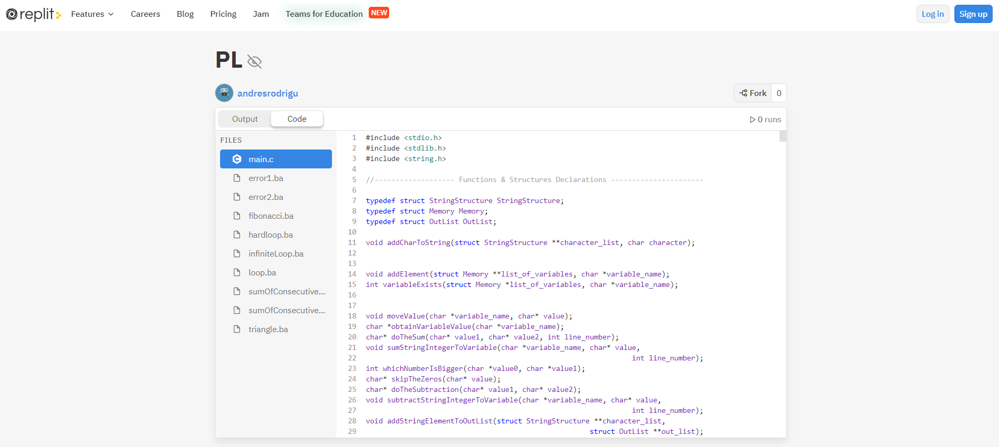

It has stopped writing the .xl extension documents in order to make an interpreter as realistic as
possible, having to execute each line of code individually (as long as it is correct) there have been
problems with writing .xl documents in the loops, also it has not wanted to interpret the results of
the .xl documents because that would rather simulate a compiler (since we would be reading the
entire document first). As nothing has been said about writing .xl documents in this project it has
been decided to stop doing it.
This report will go by the order in which the algorithms were designed, the cited part of code will be
shown in each section.

## 2) PARSER & INTERPRETER

### 2.a Design of The Algorithm

For the solution of the parser problem, it has been decided to implement the most obvious solution,
create states where one can be found and be guided by them. In order to implement this, it has been
decided to make FSMs of any state in which we may find ourselves.

Note: all the different situations that could occur (wrong situations) have not been shown in the
FSMs due to their density. Any input other than those shown that can occur in all states except the
initial one will be counted as reject.

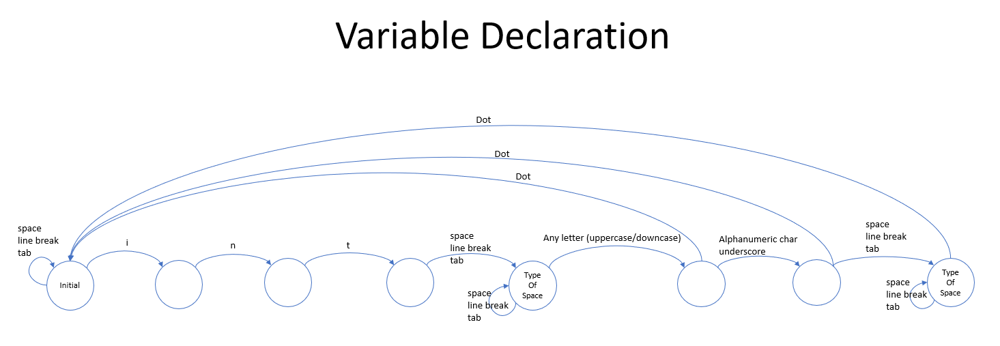
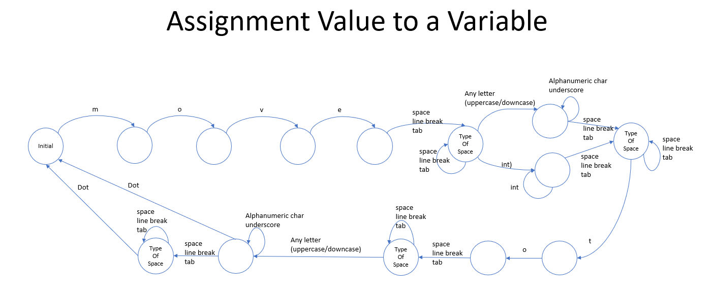
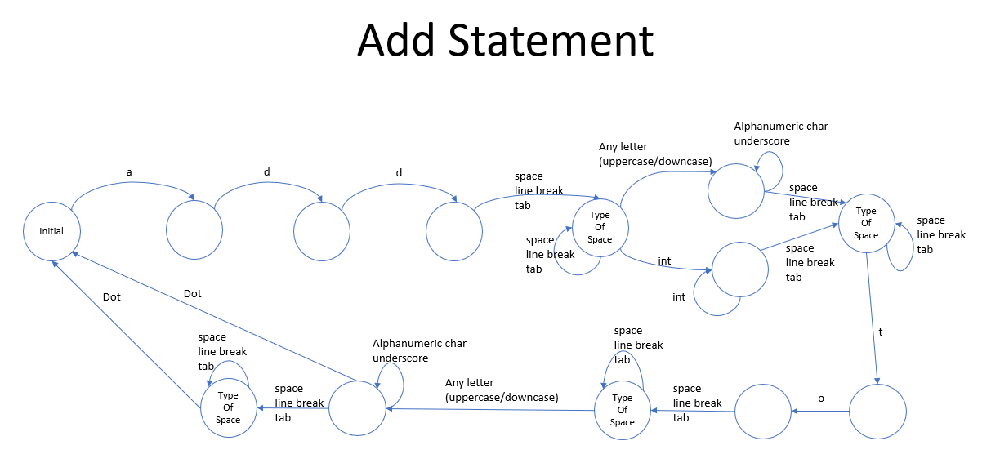
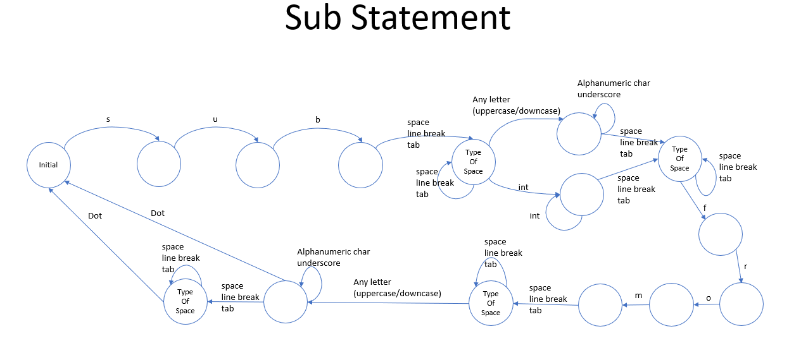
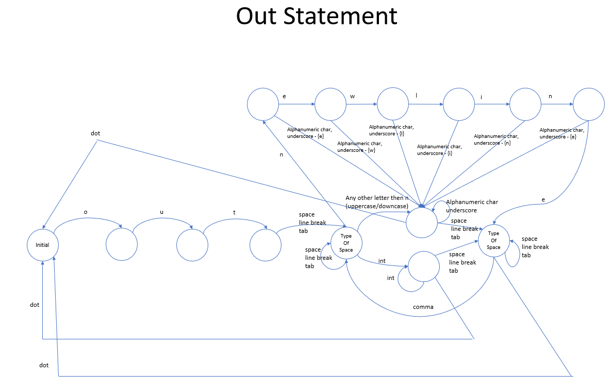

Also, despite the fact that we are talking about a parser, let us remember that it will play a very
important role with the interpreter, because the interpreter will execute each correct line of code
that it sees.

Having said this we are aware that until a line of code does not finalize it will not be able to be
executed, these make us think that it will be necessary to save each element read, be it strings,
number values, etc...

Having said this, it has been thought to use two global variables, one of which will save the numerical
values read and the other the variable name, the reason for this is because if we remember the add,
sub and loop instructions technically use one variable and one numerical value.

We will also need a structure such that it can save the elements that are going to be printed,
remember that there are two types of elements that can be printed, which are the structure that we
created for the strings and character arrays.

We will also need a memory that stores all the variables declared by the user.

Finally, I would like to emphasize the issue of loops, in the last finite state machine shown it can be
clearly seen that loops will be a delicate situation, either due to the situations they contain or
because when designing an interpreter each line must be executed of code one by one, so from now
on we can guess that we will need two functions, one that will execute the lines of code that the
main block contains and the other that executes a loop block.

For the errors, an encoding table will be made which is helped by the FSMs shown and the encoding
of the stored word that could already be seen in the previous project, so the user will be notified of
the most exact errors possible.

Having said all this, we already know that all the functions that have to do with variables will also
have to be done (such as moving a value, adding, subtracting, etc...), these functions and the output
functions only and will only be executed when a line of code read has been validated thanks to the
FSMs, basically the required function will be put into operation when an end of line has been
reached.

### 2.b Memory

It has been decided to design a memory that stores the variables created by the user and thus be
able to know when the user is using a variable that he has not declared before.

For the memory design, the most obvious structure has been thought, a linked list, in which each
node stores the name of the variable, its value (which for now is not necessary but as it will be
needed in the second project from now on has done) and the next node that has to arrive.

The saved values will be of the character array type because we remember that what is read is saved
in a character array type variable, also because this language tells us that the numbers can have a
maximum of one hundred digits.

Also, from now on we want to emphasize that if the user declared an existing variable, the value
would be reset to said variable, like Python.

To increase speed, it has been decided to design the linked list in such a way that it works the other
way around, this is because normally whenever a variable is declared it is used at the time.

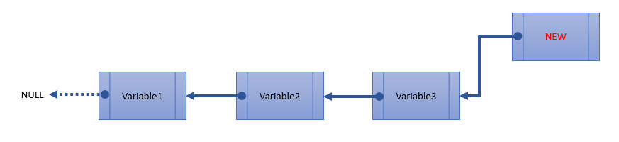

### 2.c Outs

For the outputs a structure will be used such that it can store the elements that are going to be
printed, remember that there are two elements that can be printed, also remember that C does not
have generic data types, for this a variable will be used that tells us if the saved element is a string or
an array of characters, to save the referred element a void type pointer will be used.

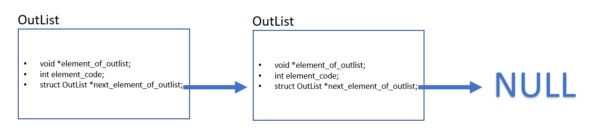

### 2.e Arithmetic Operations

In order to give the correct results of the arithmetic operations, it has been necessary to partition the
cases that may occur, which are the ones shown below.

Having noted these situations, the required algorithms have been designed by partitioning the
situations. Two functions have been made which will take two positive values, one for addition and
the other for subtraction. Two other functions have been made which will queue the values
obtained, when I say strain, I mean as if you wanted to add zero to a variable, or if you wanted to
subtract a negative number from a variable of positive value that would actually be making a sum,
straining the values will be sent to the necessary functions if necessary.

We must also remember that a problem arises in the subtractions because all the operations will be
done manually, for example, let's say that the user wants to subtract nine hundred and ninety-eight
to nine hundred and ninety-nine, when doing it manually we would obtain two zeros in the prefix
which would not be desired, this forces us to have to write a function which would eliminate the
unnecessary zeros from the numerical values, which will also help in reading the code, so if the user
enters unnecessary zeros in the code they will not be taken into account.

Also remember that the problem arises that the result of a sum exceeds one hundred digits, for that
reason, additionally this situation will also be controlled in the function of the sums.

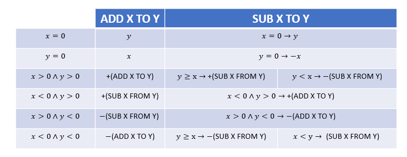

### 2.f Execution of Blocks

The same code that was used in the lexical analyzer will be used to execute the main blocks with the
only difference that an .xl document will not be written and it will also be taken into account when a
loop instruction has been read, in order to send it to a function written especially for loops that takes
into account from one-line loops to nested loops.

The design of the function that will execute the loops has been done in the style of unit tests, writing
tests of all possible situations and correcting the code based on errors.

I would also like to emphasize that if a negative or zero value is given for a loop, the program will also
analyze the code, only without yielding results of operations or outs.

The values of the loops will always be subtracted one at the end of the instruction, after the
subtraction if the value is not equivalent to zero (when we speak of positive values at the beginning)
the code will be executed again from the beginning of the point that it started.

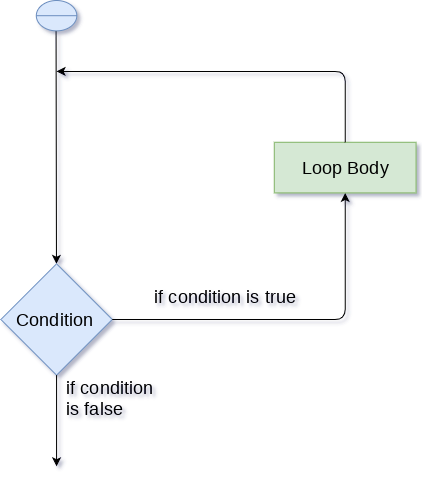

## 3) USER INPUTS & INTERPRETER IMPLEMENTATION

Now only the name of the file that you want to execute will be taken, for each program execution
only one script will be able to be executed.
As in the previous project, file names of any length can be taken.

## 4) Test Screenshots

### 4.a Finding the nth Fibonacci of 101 Digits

...
...
...
...

### 4.b Finding The Sum of The Consecutive Numbers Squared

### 4.c Drawing a Right-Angled Triangle

### 4.d Syntax Error Example

### 4.e Syntax Error Example

